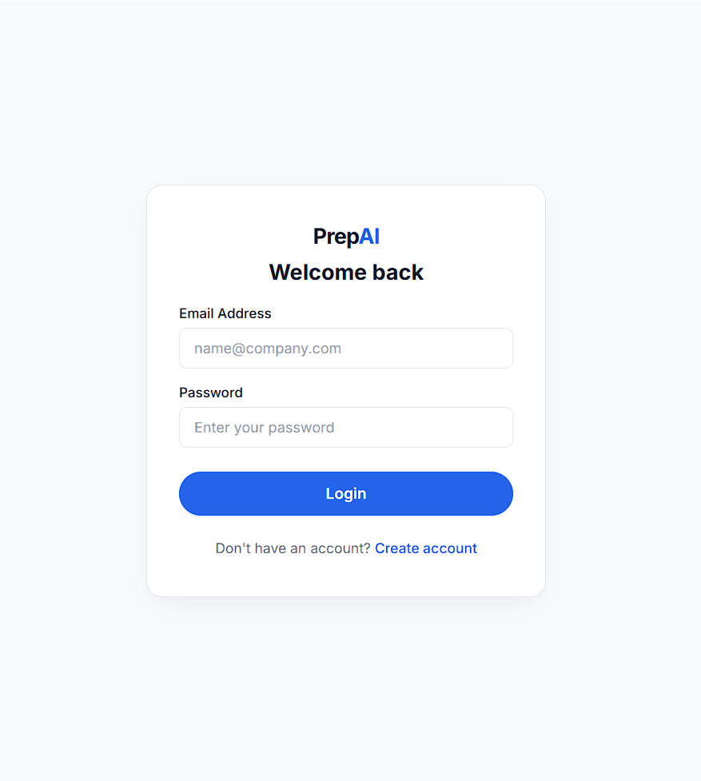
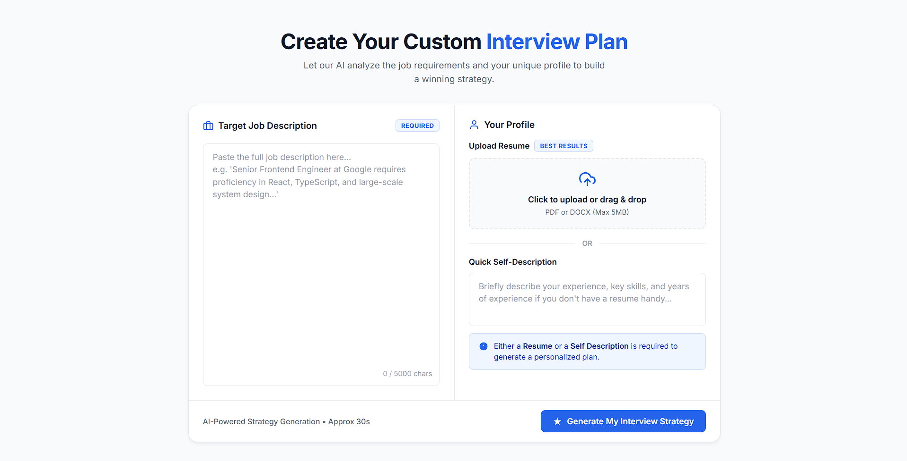
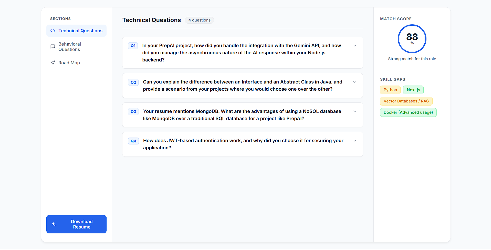
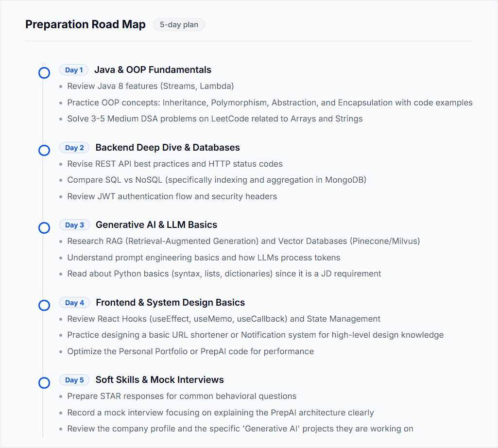

# PrepAI

### AI-Powered Interview Preparation Platform

PrepAI is a full-stack AI-powered interview preparation platform that analyzes a candidate's resume against a target job description and generates a personalized interview preparation strategy.

It uses Google's Gemini API to generate interview questions, identify skill gaps, calculate a job-match score, and create a structured preparation roadmap.

## 🚀 Live Demo

**[Open PrepAI](https://prep-ai-nine-iota.vercel.app/)**

---

## ✨ Features

### 🔐 Authentication

- User registration and login
- JWT-based authentication
- Protected routes
- HTTP-only authentication cookies
- Logout functionality

### 📄 Resume Analysis

- Upload resume in PDF format
- Extract resume content automatically
- Compare resume skills with job requirements
- Analyze candidate profile against a target role

### 🤖 AI Interview Strategy

- AI-generated job match score
- Technical interview questions
- Behavioral interview questions
- Question intentions
- Suggested model answers
- Personalized skill-gap analysis

### 🗺️ Preparation Roadmap

- Personalized multi-day preparation plan
- Topic-specific preparation tasks
- Java and DSA preparation
- React and JavaScript preparation
- Backend and database preparation
- CS fundamentals revision
- Mock interview preparation

### 📥 Resume Generation

- Generate a tailored resume based on the target job
- AI-assisted resume content generation
- Convert generated HTML into PDF
- Download the generated resume directly from the platform

### 📊 Interview History

- Save generated interview reports
- View previous reports
- Access reports associated with the logged-in user

---

# 🖥️ Screenshots

## 🔐 Login

<p align="center">
  
</p>

---

## 📝 Interview Strategy Generator

<p align="center">
  
</p>

---

## 📊 AI Interview Report

<p align="center">
  
</p>

---

## 🗺️ Preparation Roadmap

<p align="center">
  
</p>

---

# 🏗️ Application Architecture

```text
                    ┌──────────────────────┐
                    │      PrepAI User     │
                    └──────────┬───────────┘
                               │
                               ▼
                    ┌──────────────────────┐
                    │   React Frontend     │
                    │       Vercel         │
                    └──────────┬───────────┘
                               │
                            REST API
                               │
                               ▼
                    ┌──────────────────────┐
                    │  Node.js + Express   │
                    │       Render         │
                    └───────┬───────┬──────┘
                            │       │
                 ┌──────────┘       └──────────┐
                 ▼                             ▼
       ┌──────────────────┐          ┌──────────────────┐
       │   MongoDB Atlas  │          │   Gemini API     │
       │   Data Storage   │          │  AI Generation   │
       └──────────────────┘          └──────────────────┘
                            │
                            ▼
                   ┌──────────────────┐
                   │    Puppeteer     │
                   │   PDF Generator  │
                   └──────────────────┘